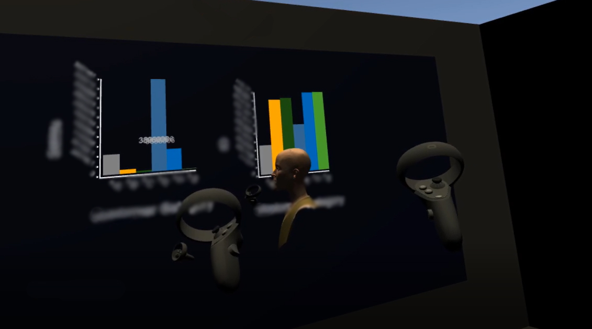

# Collaborative immersive data analytics of key-customer data

## Table of Contents

- [About](#about)
- [Getting Started](#getting_started)
- [Usage](#usage)

## About <a name = "about"></a>

This repo contains the prototype of a 8th semester Medialogy project.
The project revovled around the development of a collaborative tool in an immersive setting (VR), where visual analytics could be performed.

## Getting Started <a name = "getting_started"></a>

These instructions will get you a copy of the project up and running on your local machine for development and testing purposes.

### Prerequisites

```
A virtual reality headset - preferably Quest, as the prototype was designed and tested for this
```
```
A running version of the Unity Editor 2019.3
```

### Installing

A step by step that tell you how to get the project up and running.

1: Fetch Git repo with prequisites fullfilled

2: Place a dataset into the following directory like so (naming is important) (you might have to create env + src folders)

```
\Assets\Resources\env\src\DataSet1.csv
```

3: You should build the project to your respective VR headset

4: Enjoy!

## Usage <a name = "usage"></a>

Game requires an active internet connection to play. Once the game has started, you and your friends can join eachother and present each others plots.


